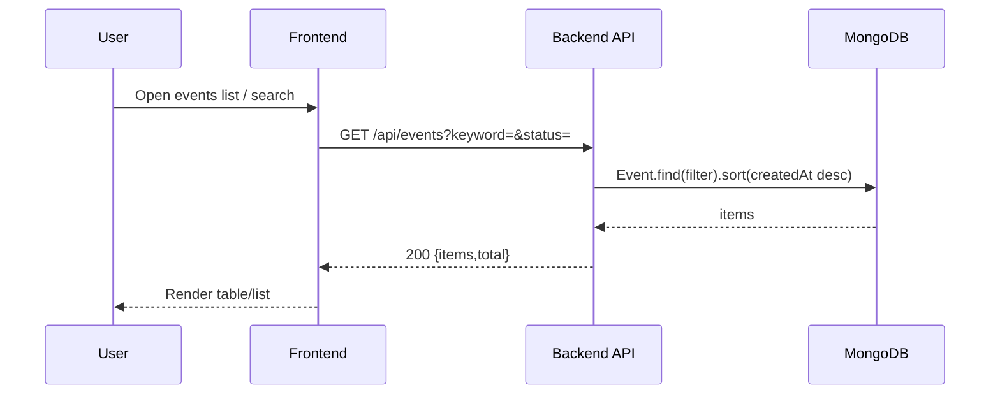
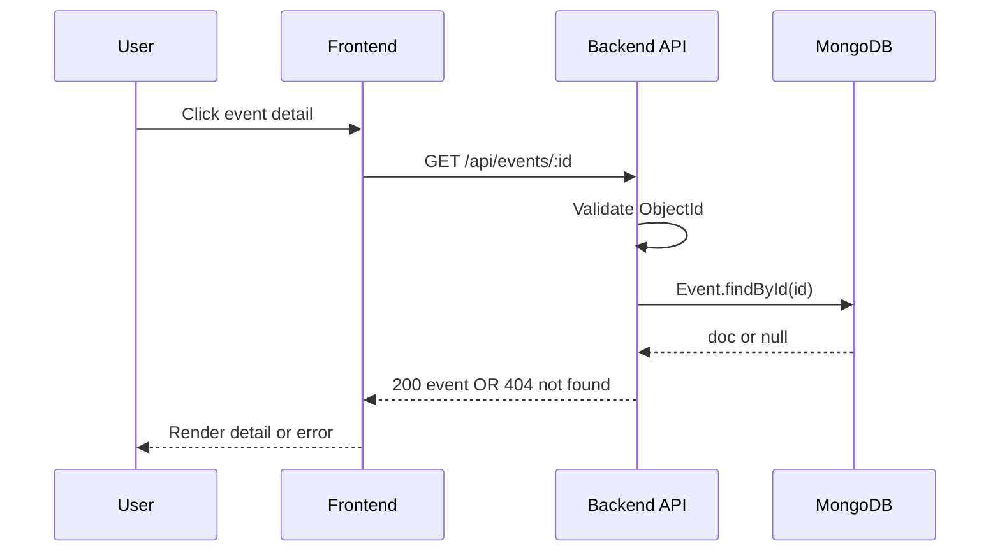
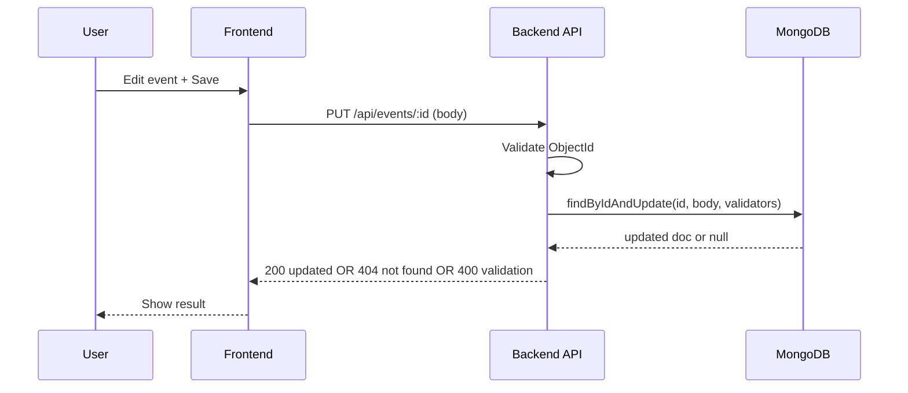
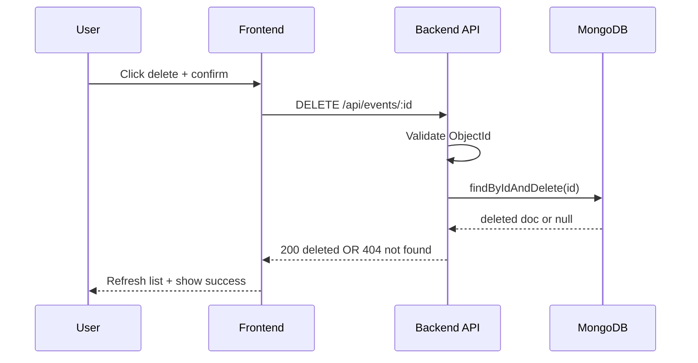
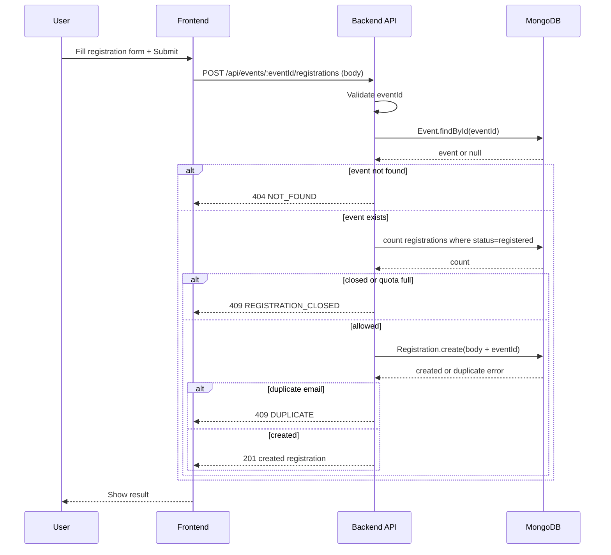
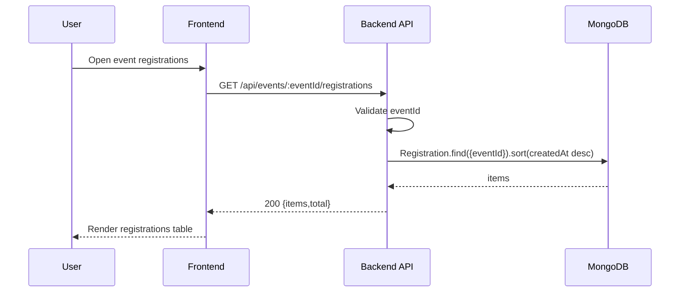
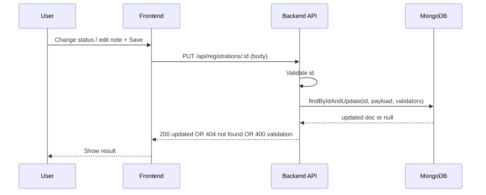
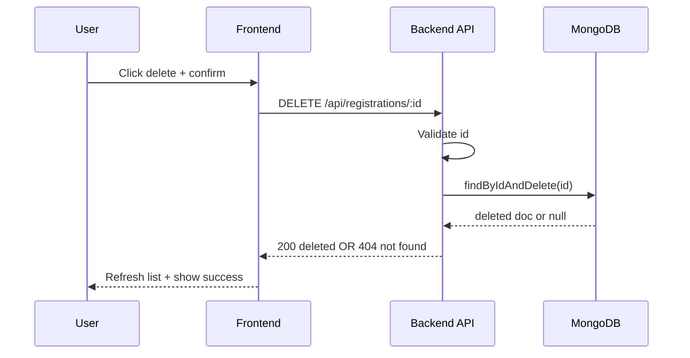

### `docs/api-spec.md`

````md
# API Spec (Events + Registrations)

## Base URL
- `http://localhost:4000/api`

## Response Format

### Success
```json
{
  "success": true,
  "message": "OK",
  "data": {},
  "error": null
}
````

### Fail

```json
{
  "success": false,
  "message": "Validation failed",
  "data": null,
  "error": {
    "code": "VALIDATION_ERROR",
    "details": ["title is required"]
  }
}
```

## Error Codes

* `VALIDATION_ERROR`
* `INVALID_ID`
* `NOT_FOUND`
* `DUPLICATE`
* `REGISTRATION_CLOSED`
* `SERVER_ERROR`

---

# Events

## POST /events

Create an event

Request Body

```json
{
  "title": "迎新說明會",
  "description": "活動介紹與QA",
  "date": "2026-01-20T10:00:00.000Z",
  "location": "商館B1",
  "quota": 50,
  "status": "published"
}
```

Response 201

```json
{
  "success": true,
  "message": "Event created",
  "data": {
    "_id": "EVENT_ID",
    "title": "迎新說明會",
    "description": "活動介紹與QA",
    "date": "2026-01-20T10:00:00.000Z",
    "location": "商館B1",
    "quota": 50,
    "status": "published",
    "createdAt": "ISO_DATE",
    "updatedAt": "ISO_DATE",
    "__v": 0
  },
  "error": null
}
```

Response 400 (validation)

```json
{
  "success": false,
  "message": "Validation failed",
  "data": null,
  "error": {
    "code": "VALIDATION_ERROR",
    "details": ["title is required"]
  }
}
```

---

## GET /events

Read all events

Query Params (optional)

* `keyword` (string): filter by title (case-insensitive)
* `status` (string): `published` | `closed`

Example

* `/events`
* `/events?status=published`
* `/events?keyword=迎新`

Response 200

```json
{
  "success": true,
  "message": "Events fetched",
  "data": {
    "items": [
      {
        "_id": "EVENT_ID",
        "title": "迎新說明會",
        "date": "2026-01-20T10:00:00.000Z",
        "location": "商館B1",
        "quota": 50,
        "status": "published",
        "createdAt": "ISO_DATE",
        "updatedAt": "ISO_DATE"
      }
    ],
    "total": 1
  },
  "error": null
}
```

---

## GET /events/:id

Read single event

Path Params

* `id` (string): event id

Response 200

```json
{
  "success": true,
  "message": "Event fetched",
  "data": {
    "_id": "EVENT_ID",
    "title": "迎新說明會",
    "description": "活動介紹與QA",
    "date": "2026-01-20T10:00:00.000Z",
    "location": "商館B1",
    "quota": 50,
    "status": "published",
    "createdAt": "ISO_DATE",
    "updatedAt": "ISO_DATE"
  },
  "error": null
}
```

Response 400 (invalid id)

```json
{
  "success": false,
  "message": "Invalid event id",
  "data": null,
  "error": {
    "code": "INVALID_ID",
    "details": ["BAD_ID"]
  }
}
```

Response 404 (not found)

```json
{
  "success": false,
  "message": "Event not found",
  "data": null,
  "error": {
    "code": "NOT_FOUND",
    "details": ["EVENT_ID"]
  }
}
```

---

## PUT /events/:id

Update an event

Path Params

* `id` (string): event id

Request Body (partial allowed)

```json
{
  "location": "商館B2",
  "quota": 60,
  "status": "closed"
}
```

Response 200

```json
{
  "success": true,
  "message": "Event updated",
  "data": {
    "_id": "EVENT_ID",
    "title": "迎新說明會",
    "location": "商館B2",
    "quota": 60,
    "status": "closed",
    "createdAt": "ISO_DATE",
    "updatedAt": "ISO_DATE"
  },
  "error": null
}
```

Response 400 (validation)

```json
{
  "success": false,
  "message": "Validation failed",
  "data": null,
  "error": {
    "code": "VALIDATION_ERROR",
    "details": ["quota must be at least 1"]
  }
}
```

Response 404 (not found)

```json
{
  "success": false,
  "message": "Event not found",
  "data": null,
  "error": {
    "code": "NOT_FOUND",
    "details": ["EVENT_ID"]
  }
}
```

---

## DELETE /events/:id

Delete an event

Path Params

* `id` (string): event id

Response 200

```json
{
  "success": true,
  "message": "Event deleted",
  "data": {
    "_id": "EVENT_ID",
    "title": "迎新說明會"
  },
  "error": null
}
```

Response 404 (not found)

```json
{
  "success": false,
  "message": "Event not found",
  "data": null,
  "error": {
    "code": "NOT_FOUND",
    "details": ["EVENT_ID"]
  }
}
```

---

# Registrations

## POST /events/:eventId/registrations

Create a registration for an event

Path Params

* `eventId` (string): event id

Request Body

```json
{
  "name": "王小明",
  "email": "test@example.com",
  "phone": "0912345678",
  "note": "想坐前排",
  "status": "registered"
}
```

Response 201

```json
{
  "success": true,
  "message": "Registration created",
  "data": {
    "_id": "REG_ID",
    "eventId": "EVENT_ID",
    "name": "王小明",
    "email": "test@example.com",
    "phone": "0912345678",
    "note": "想坐前排",
    "status": "registered",
    "createdAt": "ISO_DATE",
    "updatedAt": "ISO_DATE",
    "__v": 0
  },
  "error": null
}
```

Response 400 (invalid event id)

```json
{
  "success": false,
  "message": "Invalid event id",
  "data": null,
  "error": {
    "code": "INVALID_ID",
    "details": ["BAD_ID"]
  }
}
```

Response 404 (event not found)

```json
{
  "success": false,
  "message": "Event not found",
  "data": null,
  "error": {
    "code": "NOT_FOUND",
    "details": ["EVENT_ID"]
  }
}
```

Response 409 (quota full / closed)

```json
{
  "success": false,
  "message": "Registration closed or quota full",
  "data": null,
  "error": {
    "code": "REGISTRATION_CLOSED",
    "details": []
  }
}
```

Response 409 (duplicate email for same event)

```json
{
  "success": false,
  "message": "Duplicate registration (same email)",
  "data": null,
  "error": {
    "code": "DUPLICATE",
    "details": []
  }
}
```

Response 400 (validation)

```json
{
  "success": false,
  "message": "Validation failed",
  "data": null,
  "error": {
    "code": "VALIDATION_ERROR",
    "details": ["email is required", "name is required"]
  }
}
```

---

## GET /events/:eventId/registrations

Read registrations by event

Path Params

* `eventId` (string): event id

Response 200

```json
{
  "success": true,
  "message": "Registrations fetched",
  "data": {
    "items": [
      {
        "_id": "REG_ID",
        "eventId": "EVENT_ID",
        "name": "王小明",
        "email": "test@example.com",
        "status": "registered",
        "createdAt": "ISO_DATE",
        "updatedAt": "ISO_DATE"
      }
    ],
    "total": 1
  },
  "error": null
}
```

---

## PUT /registrations/:id

Update a registration

Path Params

* `id` (string): registration id

Request Body (partial allowed)

```json
{
  "status": "cancelled",
  "note": "臨時有事"
}
```

Response 200

```json
{
  "success": true,
  "message": "Registration updated",
  "data": {
    "_id": "REG_ID",
    "eventId": "EVENT_ID",
    "name": "王小明",
    "email": "test@example.com",
    "status": "cancelled",
    "note": "臨時有事",
    "createdAt": "ISO_DATE",
    "updatedAt": "ISO_DATE"
  },
  "error": null
}
```

Response 404 (not found)

```json
{
  "success": false,
  "message": "Registration not found",
  "data": null,
  "error": {
    "code": "NOT_FOUND",
    "details": ["REG_ID"]
  }
}
```

---

## DELETE /registrations/:id

Delete a registration

Path Params

* `id` (string): registration id

Response 200

```json
{
  "success": true,
  "message": "Registration deleted",
  "data": {
    "_id": "REG_ID",
    "eventId": "EVENT_ID",
    "email": "test@example.com"
  },
  "error": null
}
```

Response 404 (not found)

```json
{
  "success": false,
  "message": "Registration not found",
  "data": null,
  "error": {
    "code": "NOT_FOUND",
    "details": ["REG_ID"]
  }
}
```

````

---

### `docs/architecture.md`
```md
# Architecture

## Stack
- Frontend: React + Vite + React Router + Axios
- Backend: Node.js + Express + Mongoose
- Database: MongoDB Atlas

## Local Runtime
- Frontend: `http://localhost:5174` (or Vite assigned port)
- Backend: `http://localhost:4000`
- API Base: `http://localhost:4000/api`
- Env:
  - `frontend/.env` -> `VITE_API_BASE_URL`
  - `backend/.env` -> `PORT`, `MONGO_URI`

## Backend Route Mount
- `app.use("/api/events", eventRoutes);`
- `app.use("/api", registrationRoutes);`

## Project Structure
```txt
web_end_project/
  frontend/
    src/
      api/
      components/
      pages/
      router/
      styles/
  backend/
    src/
      config/
      controllers/
      models/
      routes/
      app.js
      server.js
  docs/
````

## Diagram

```mermaid
graph LR
  U[User] --> FE[Frontend: React (Vite)]
  FE -->|Axios HTTP| BE[Backend: Express API]
  BE -->|Mongoose| DB[(MongoDB Atlas)]

  subgraph Frontend
    FE --> FE_P[Pages]
    FE --> FE_C[Components]
    FE --> FE_A[API Modules]
  end

  subgraph Backend
    BE --> BE_R[Routes]
    BE_R --> BE_CT[Controllers]
    BE_CT --> BE_M[Models]
  end
```

````

---

### `docs/flowchart.md`
```md
# Flowchart

## Overall CRUD Flow
```mermaid
flowchart LR
  U[User Action] --> FE[Frontend UI]
  FE -->|Axios| API[Express API]
  API -->|Mongoose| DB[(MongoDB)]
  DB --> API
  API -->|JSON Response| FE
  FE --> U
````

## Events - Create (POST /api/events)

```mermaid
sequenceDiagram
  participant U as User
  participant FE as Frontend
  participant API as Backend API
  participant DB as MongoDB

  U->>FE: Fill event form + Submit
  FE->>API: POST /api/events (body)
  API->>DB: Event.create(body)
  DB-->>API: created document
  API-->>FE: 201 {success:true,data:event}
  FE-->>U: Show success + navigate/list refresh
```

## Events - Read List (GET /api/events)



## Events - Read Single (GET /api/events/:id)



## Events - Update (PUT /api/events/:id)



## Events - Delete (DELETE /api/events/:id)



## Registrations - Create (POST /api/events/:eventId/registrations)



## Registrations - Read By Event (GET /api/events/:eventId/registrations)



## Registrations - Update (PUT /api/registrations/:id)



## Registrations - Delete (DELETE /api/registrations/:id)

